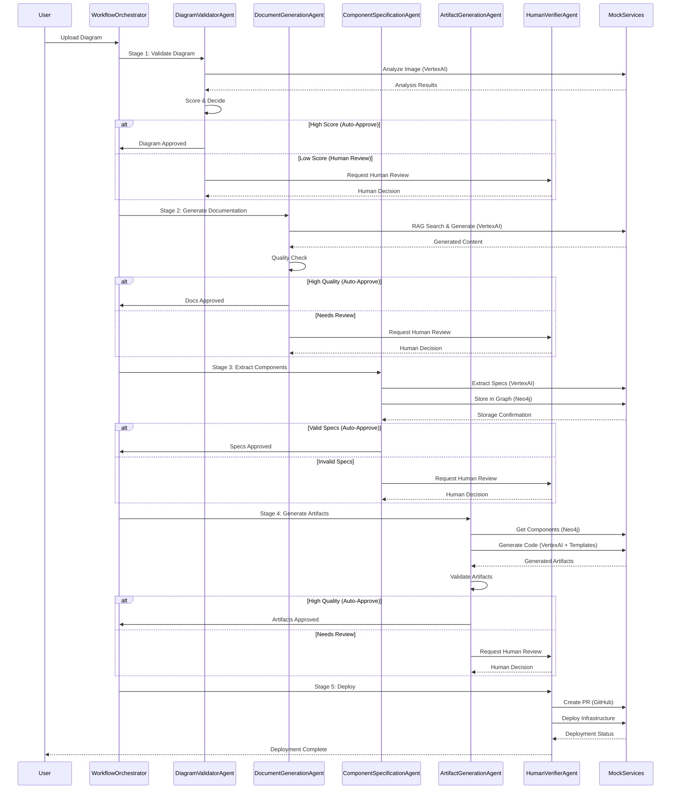
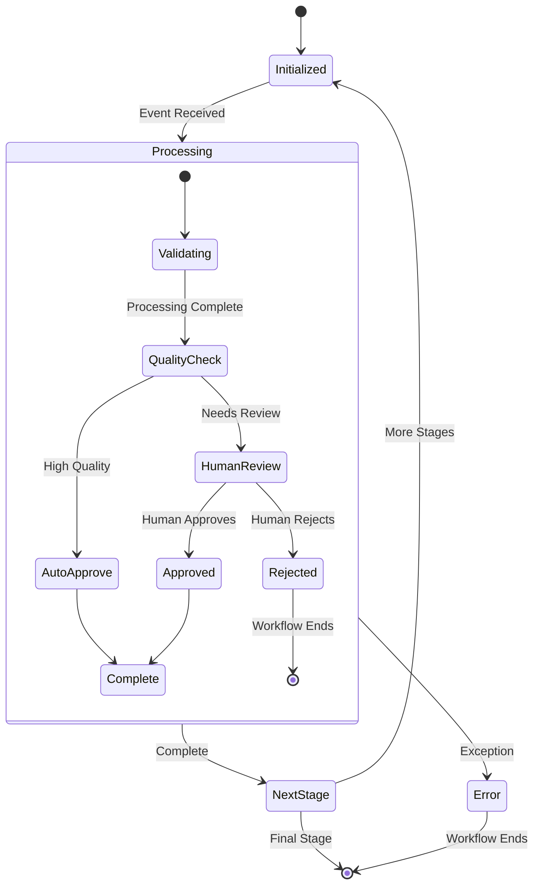

# EnGen Agent Framework Class Diagram (Mermaid)

## Complete Class Diagram with Relationships

```mermaid
classDiagram
    %% Base Agent Class
    class Agent {
        <<abstract>>
        +MockMonitoring monitoring
        +str agent_id
        +str version
        +str status
        +on_event(event)
        +request_human_verification(type, data)
    }

    %% Stage 1: Diagram Validation
    class DiagramValidatorAgent {
        +MockPubSub publisher
        +str topic_path
        +int approval_threshold
        +int max_reference_patterns
        +on_gcs_upload(event)
        +validate_diagram(image_bytes)
        +score_similarity(analysis_result)
        +get_reference_patterns(pattern_type)
        +decide_approval(score, confidence)
    }

    %% Stage 2: Document Generation
    class DocumentGenerationAgent {
        +dict doc_templates
        +float quality_threshold
        +dict generation_metrics
        +on_diagram_validated(event)
        +generate_documentation(validation_data)
        +enhance_with_rag(content, context)
        +apply_document_templates(sections)
        +quality_check_content(content)
        +format_final_document(sections)
    }

    %% Stage 3: Component Specification
    class ComponentSpecificationAgent {
        +MockNeo4jDriver driver
        +SchemaValidator schema_validator
        +ExtractionEngine extraction_engine
        +GraphManager graph_manager
        +on_docs_approved(event)
        +extract_components(documentation)
        +validate_schema(components)
        +store_in_graph(components, relationships)
        +build_relationships(components)
    }

    %% Stage 4: Artifact Generation
    class ArtifactGenerationAgent {
        +MockNeo4jDriver driver
        +list supported_artifact_types
        +float validation_threshold
        +dict template_cache
        +dict generation_metrics
        +on_specs_approved(event)
        +generate_artifacts(context, comp_id)
        +validate_artifacts(artifacts, comp_id)
        +generate_from_template(comp_type, artifact_type, context)
        +get_pattern_components(pattern_id)
        +get_component_context(comp_id)
    }

    %% Stage 5: Human Verification
    class HumanVerifierAgent {
        +dict verification_queue
        +dict review_sessions
        +list notification_channels
        +DeploymentManager deployment_manager
        +on_verification_request(event)
        +create_review_session(request_data)
        +notify_reviewers(session_id, reviewers)
        +handle_approval(session_id, decision)
        +handle_rejection(session_id, feedback)
        +deploy_artifacts(artifacts)
    }

    %% Workflow Orchestrator
    class WorkflowOrchestrator {
        +DiagramValidatorAgent diagram_agent
        +DocumentGenerationAgent doc_agent
        +ComponentSpecificationAgent spec_agent
        +ArtifactGenerationAgent artifact_agent
        +HumanVerifierAgent human_agent
        +dict workflow_state
        +int current_stage
        +start_workflow(diagram_upload_event)
        +run_stage_1(event)
        +run_stage_2()
        +run_stage_3()
        +run_stage_4()
        +run_stage_5()
    }

    %% Mock Services
    class MockMonitoring {
        +log_error(message)
        +log_event(message)
        +log_warning(message)
    }

    class MockStorage {
        +read_file(bucket, path) bytes
        +write_file(bucket, path, content)
        +list_files(bucket, prefix) list
    }

    class MockVertexAI {
        +analyze_image(model, image, prompt, refs, params) dict
        +generate_text(model, prompt, image, format, params) str
        +vector_search(index, query, filter, num_results) list
    }

    class MockPubSub {
        +publish(topic, data)
        +subscribe(subscription, callback)
        +create_topic(topic)
    }

    class MockBigTable {
        +get_row(instance_id, table_id, row_key) MockRow
        +put_row(instance_id, table_id, row_key, data)
        +scan_table(instance_id, table_id, filter) list
    }

    class MockNeo4j {
        +Driver(uri, auth) MockNeo4jDriver
        +secret(name) str
    }

    class MockNeo4jDriver {
        +session() MockNeo4jSession
    }

    class MockNeo4jSession {
        +run(query, params) MockResult
        +close()
    }

    class MockGitHub {
        +create_pr(repo, title, body, branch) dict
        +merge_pr(repo, pr_number) dict
        +get_repo(repo_name) dict
    }

    class MockDialogflow {
        +create_session(project, session_id) str
        +detect_intent(session, text) dict
        +fulfill_intent(session, intent) dict
    }

    %% Inheritance Relationships
    Agent <|-- DiagramValidatorAgent
    Agent <|-- DocumentGenerationAgent
    Agent <|-- ComponentSpecificationAgent
    Agent <|-- ArtifactGenerationAgent
    Agent <|-- HumanVerifierAgent

    %% Composition Relationships
    WorkflowOrchestrator *-- DiagramValidatorAgent
    WorkflowOrchestrator *-- DocumentGenerationAgent
    WorkflowOrchestrator *-- ComponentSpecificationAgent
    WorkflowOrchestrator *-- ArtifactGenerationAgent
    WorkflowOrchestrator *-- HumanVerifierAgent

    %% Agent Dependencies on Mock Services
    Agent *-- MockMonitoring
    DiagramValidatorAgent ..> MockVertexAI : uses
    DiagramValidatorAgent ..> MockStorage : uses
    DiagramValidatorAgent ..> MockPubSub : uses
    
    DocumentGenerationAgent ..> MockVertexAI : uses
    DocumentGenerationAgent ..> MockStorage : uses
    DocumentGenerationAgent ..> MockBigTable : uses
    
    ComponentSpecificationAgent ..> MockNeo4j : uses
    ComponentSpecificationAgent ..> MockVertexAI : uses
    ComponentSpecificationAgent ..> MockStorage : uses
    
    ArtifactGenerationAgent ..> MockNeo4j : uses
    ArtifactGenerationAgent ..> MockBigTable : uses
    ArtifactGenerationAgent ..> MockVertexAI : uses
    
    HumanVerifierAgent ..> MockGitHub : uses
    HumanVerifierAgent ..> MockDialogflow : uses
    HumanVerifierAgent ..> MockStorage : uses

    %% Neo4j Internal Relationships
    MockNeo4j ..> MockNeo4jDriver : creates
    MockNeo4jDriver ..> MockNeo4jSession : creates
```

## Workflow Sequence Diagram

## Agent State Machine

This Mermaid diagram shows the complete EnGen framework with inheritance relationships, composition patterns, service dependencies, workflow sequences, and state management patterns.
